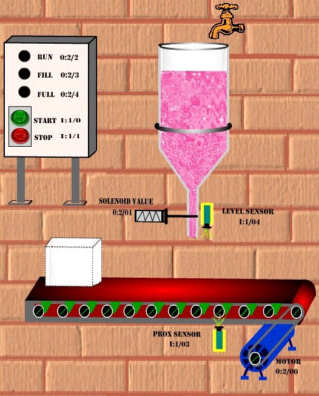
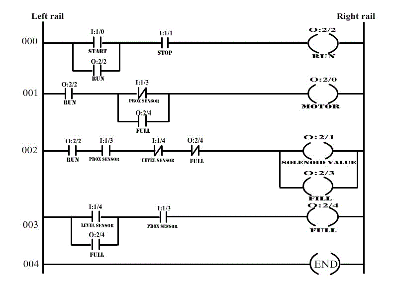
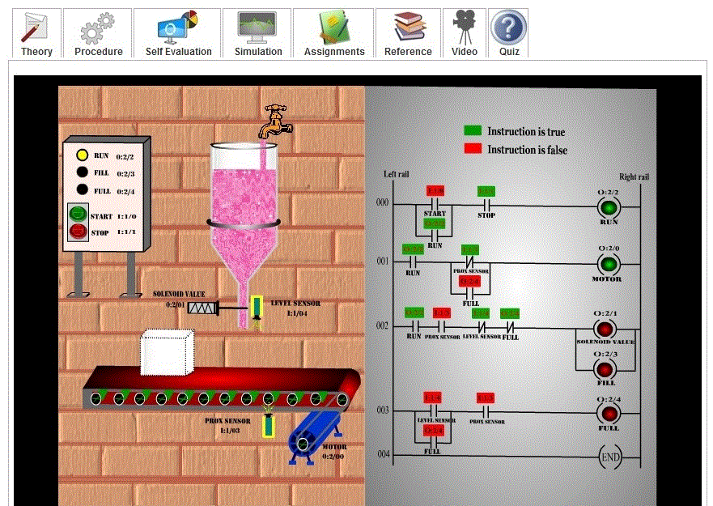
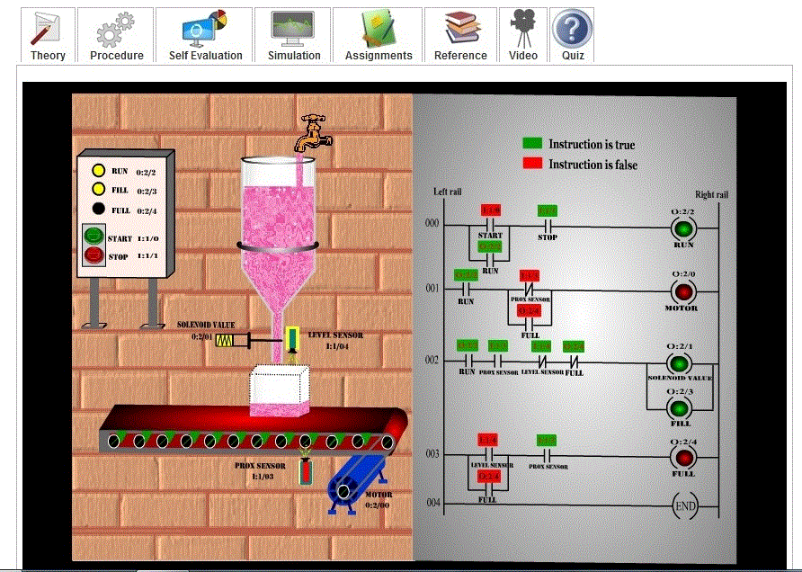
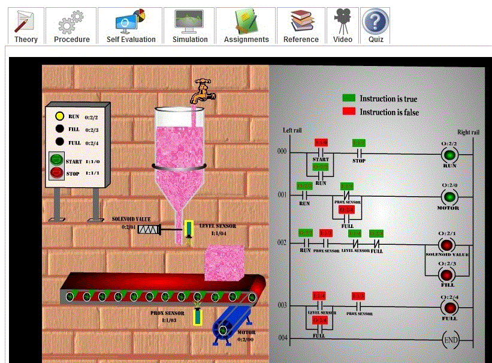

### Aim of the experiment: Container filling process using a programmable logic controller

<u><strong>Aim</u> : </strong>
Container filling process using a programmable logic controller.

### Procedure :

<u><strong>Procedure</u> : </strong>
In our experiment, we wish to have a container filling process using a programmable logic controller.
 Let us see its basic diagram:

 

<ul type=disc style="text-align: justify;">
<li>Since the inputs and outputs to the PLC are less, 8-point input module and 8-point output modules is sufficient, where CPU resides in slot 0, input module resides in slot and output module in slot 2.and output signal.</li> 
<li>Let us assign address for the input and output signals of the PLC:  

<ul type=square>
<li>Start (Normally open push button) : I:1/0</li> 
<li>Stop (Normally closed push button) :I:1/1</li> 
<li>MOTOR: O:2/0</li> 
<li>SOLENOID VALUE : O:2/1</li> 
<li>RUN (LED) : O:2/2</li> 
<li>FILL (LED) : O:2/3</li> 
<li>FULL (LED) : O:2/4</li> 
<li>PROX SENSOR(Proximity sensor) : I:1/3</li> 
<li>LEVEL SENSOR(Level sensor) : I:1/4</li> 
</ul>
</li>

<li>Let us see its ladder logic diagram: 

 

</li>

<li>Here, when the start push button is pressed, Container filling process gets started (motor is turned on) and RUN LED will glow. When the container reaches the filling position, proximity sensor (PROX SENSOR) senses its position and motor is stopped and solenoid valve will open. So the container starts filling till the container gets filled. During this time, FILL LED will glow. Once the container gets filled, completely, level sensor will sense the maximum limit and solenoid valve is closed. During this time, FULL LED will glow. Now, motor is started and container moves over the conveyor. This process is continuously executed.</li> 
<li>In order to understand the working of container filling process, click the start and stop push buttons and observe the ladder diagram and LED’s correspondingly</li>
</ul>

The following screen shot explains the operation:
<ul type=disc style="text-align: justify;">
<li>

 

The above screen shot shows the condition before the current-batch container gets filled.</li>

<li>

 

The above screen shot represents the condition when the current-batch container is getting filled.</li>

<li>

 

The above screen shot shows the condition after the current-batch container gets filled and before the start of next batch.</li>
</ul>
