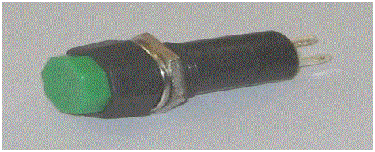
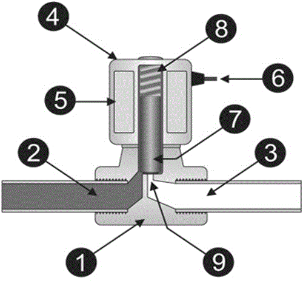

### Introduction

In order to understand, the container filling process, we need certain instrument  like Motor, Conveyor, Solenoid valve, level sensor, proximity sensor, LED's, push button and Programmable Logic Controller.

### Motor :

Motor is required to produce the torque and power required to pull the conveyor.

### Level Sensor :

Level sensors are used to detect the level of substances that flow, which include liquids, slurries, granular materials etc. The substance which is being measured can be inside a container or can be in its natural form (e.g. a river or a lake). The measurement of level can be either continuous or point values. Continuous level sensors measure level within a specified range and determine the exact amount of substance in a certain place, while point-level sensors only indicate whether the substance is above or below the sensing point.  
The selection criteria include the physical phase (liquid, solid or slurry), temperature, pressure or vacuum, chemistry, dielectric constant of the medium, specific gravity of the medium etc.

Sensors which are available for point level detection of solids are:
<ul type=disc style="text-align: justify;">
<li>Vibrating point</li>
<li>Rotating paddle</li>
<li>Admittance type</li>
</ul>

Sensors which are available for point level detection of solids are:
<ul type=disc style="text-align: justify;">
<li>Pulse-Wave ultrasonic(Non Invasive):</li>
<li>Magnetic and mechanical float</li>
<li>Pneumatic</li>
<li>Conductive</li>
</ul>

Sensor for both point level detection and continuous monitoring of solids and liquids:
<ul type=disc style="text-align: justify;">
<li>Ultrasonic</li>
<li>Capacitance</li>
<li>Optical interface</li>
<li>Microwave</li>
</ul>

Sensors for continuous level measurement of liquids:
<ul type=disc style="text-align: justify;">
<li>Magnetostrictive</li>
<li>Resistive chain </li>
<li>Hydrostatic pressure</li>
<li>Air bubbler</li>
<li>Gamma rays</li>
</ul>

For our experiment Point level detection of liquids is concerned. 

### Proximity sensor :

A <b>proximity sensor</b> is a sensor able to detect the presence of nearby objects without any physical contact.

A proximity sensor often emits an electromagnetic field or a beam of electromagnetic radiation (infrared, for instance), and looks for changes in the field or return signal. The object being sensed is often referred to as the proximity sensor's target. Different proximity sensor targets demand different sensors. For example, a capacitive photoelectric sensor might be suitable for a plastic target; an inductive proximity sensor always requires a metal target.

The maximum distance that this sensor can detect is defined "nominal range". Some sensors have adjustments of the nominal range or means to report a graduated detection distance.

Proximity sensors can have a high reliability and long functional life because of the absence of mechanical parts and lack of physical contact between sensor and the sensed object.

### Conveyor system :

A <b>conveyor system</b> is a common piece of mechanical handling equipment that moves materials from one location to another. Conveyors are especially useful in applications involving the transportation of heavy or bulky materials. Conveyor systems allow quick and efficient transportation for a wide variety of materials, which make them very popular in the material handling and packaging industries. Many kinds of conveying systems are available, and are used according to the various needs of different industries. 

### Push button :

Push button is a kind of a switch which is activated or deactivated the moment we press or depress it. It sends a signal momentarily when we press or depress it.

### Solenoid valve :

A solenoid valve is an electromechanical device used for controlling gas or liquid flow.

#### What are the different parts of solenoid?

In the above figure,
<ol type="1" style="text-align: justify;">
<li>Valve body</li>
<li>Inlet port</li>
<li>Output port</li>
<li>Coil/solenoid</li>
<li>Coil winding</li>
<li>Lead wires</li>
<li>Plunger</li>
<li>Spring</li>
<li>Orifice</li>
</ol>

The above figure shows the basic components of a solenoid valve. The above picture represents a normally-closed, direct-acting valve. This type of solenoid valve has the most simple and easy to understand principle of operation.

##### Let us see its working :

The media enters the solenoid valve through inlet port and must flow through the orifice before continuing into the outlet port. The orifice is closed and opened by the plunger. 
The valve pictured above is normally-closed solenoid valve. Normally-closed valve use a spring which presses the plunger tip against the opening of the orifice. The sealing material at the tip of the plunger keeps the media from entering the orifice, until the plunger is lifted up by an electromagnetic field created by the coil.

